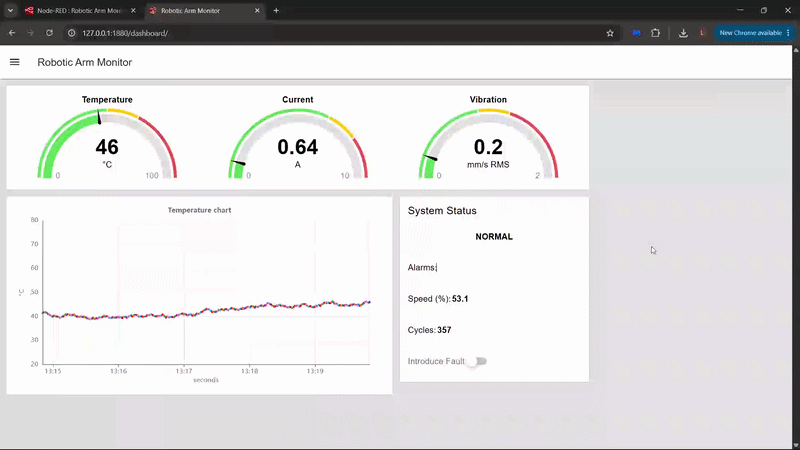

# Simulated Robotic Arm Monitoring System

A small simulated monitoring system built to demonstrate Python,
Linux, REST APIs and Node-RED.

This project simulates telemetry from an industrial robotic arm and makes it accessible through a REST API built with FastAPI.
Node-RED periodically retrieves the telemetry, processes it and displays the results through
a live monitoring dashboard.



## Technologies

- Python
- FastAPI
- Uvicorn
- REST
- JSON
- Node-RED
- JavaScript
- Linux / Ubuntu
- WSL2

## To run the project:

### 1. Clone the repository

```bash
git clone https://github.com/luke-dunlop/robotic-arm-monitor.git
cd robotic-arm-monitor
```
### 2. Create venv

```bash
python3 -m venv .venv
source .venv/bin/activate
```

### 3. Install dependencies
```bash
python -m pip install -r requirements.txt
```

### 4. Start the FastAPI server
```bash
uvicorn app.main:app
```

The API will be available at: http://127.0.0.1:8000

The documentation available at: http://127.0.0.1:8000/docs

### 5. Start Node-RED (in another terminal)
```bash
node-red
```
The Node-RED editor will be available at: http://127.0.0.1:1880

### 6. Import the Node-RED flow
Import:
```
flows/robot-monitor.json
```
into Node-RED

### 7. Open the dashboard
http://127.0.0.1:1880/dashboard
